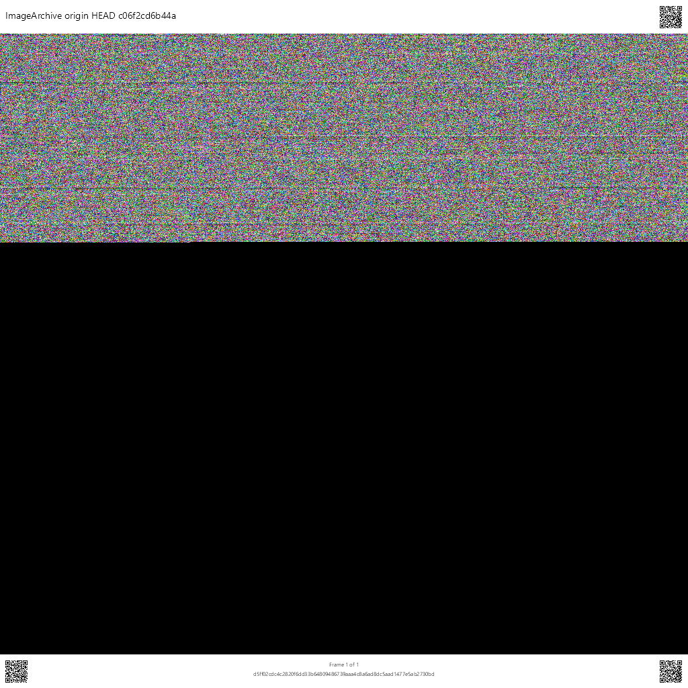

# ImageArchive

**Embed any archive (Git repository, zip, tar, or raw bytes) inside a multi-frame APNG or animated WebP image** with a visual header and footer, QR codes, and SHA-256 integrity.

The container format is defined by RFC 1.0.0: [`docs/ImageArchive-RFC.md`](docs/ImageArchive-RFC.md).

## Example image

Multi-frame APNG of this repository at `origin/HEAD`, produced by `scripts/New-OriginHeadImageArchive.ps1` with **dark chrome** (encode + decode/extract/diff verified). Header and footer QRs encode the **repo root at that commit** (`https://github.com/<owner>/<repo>/tree/<sha>`). Open the file in an APNG-capable viewer to step frames; GitHub may show only the first frame.



Regenerate:

```powershell
pwsh -File scripts/New-OriginHeadImageArchive.ps1 -Output docs/images/origin-head.png -Dark
```

## Features

- Fixed **1024×1024** frames (67 px header, 890 px data, 67 px footer)
- Data region capacity **2,734,080** bytes per frame (RGB, zero-padded final frame)
- QR cells **67×67** (65×65 modules, **1 px** margin all sides); general payload max **200** chars
- Header: free-form text, image, or numbered folder round-robin; top-right QR
- Footer: left QR (frame data SHA-256), `Frame N of M` + SHA text, right QR (tool commit URL)
- Required camelCase text metadata (`encoderName`, `jsonManifest`, `jsonSchema`, …) plus `streamSha256`
- Archive types: **raw** (default), git (compressed tar of `.git` + worktree), zip, tar
- Default codec path: **SkiaSharp 3.119.x** raster + real **APNG** / **animated WebP** containers
- Multi-target: `net8.0;net9.0;net10.0`
- CLI tool command: **`imga`** (`init` / `encode` / `decode`)
- Tests: **xUnit v3** (unit + integration, including flagship E2E)
- Build: **Nuke 10** (`build/` project targets **net10.0**)

## Solution layout

```
ImageArchive.slnx
src/ImageArchive/                 # library
src/ImageArchive.Cli/             # .NET tool (ToolCommandName=imga)
tests/ImageArchive.UnitTests/
tests/ImageArchive.IntegrationTests/
build/                            # Nuke build host
schema/imagearchive-schema.json
examples/example-manifest.json
```

## Dependencies (product pins)

| Package | Version | Notes |
|---------|---------|-------|
| SkiaSharp | 3.119.4 | Highest 3.x; Skia 4.x deferred (ZXing Skia binding) |
| ZXing.Net / Bindings.SkiaSharp | 0.16.11 / 0.16.22 | QR decode path |
| QRCoder | 1.8.0 | QR encode |
| JsonSchema.Net | 9.2.2 | Manifest schema eval |
| System.Text.Json | 10.0.10 | Manifest JSON |
| System.CommandLine | 2.0.10 | CLI package (argv currently hand-parsed) |
| xunit.v3 / runner.visualstudio | 3.2.2 / 3.1.5 | Test host |
| Microsoft.NET.Test.Sdk | 18.8.1 | VSTest |
| Nuke.Common | 10.1.0 | Build automation |

## Build and test

Requires .NET SDK **8, 9, and 10** (Nuke build host needs SDK 10).

```bash
dotnet build ImageArchive.slnx
dotnet test ImageArchive.slnx
```

### Nuke build

Bootstrap entrypoints: `build.ps1` / `build.sh` (or `dotnet run --project build/_build.csproj --`).

| Target | Purpose |
|--------|---------|
| `Clean` | Remove bin/obj and `artifacts/` |
| `Restore` / `Compile` | Restore and build solution |
| `Test` | Run unit + integration tests |
| `PackLibrary` | Pack `ImageArchive` NuGet library to `artifacts/packages/` |
| `PackCliTool` | Pack `ImageArchive.Cli` as a **.NET tool** (command: `imga`) |
| `Pack` | PackLibrary + PackCliTool |
| `PublishLibrary` | Push library package (needs `NuGetApiKey` or `NUGET_API_KEY`) |
| `PublishCliTool` | Push CLI tool package (same API key) |
| `Ci` | Clean + Test + Pack |

```bash
# Local
./build.ps1 Compile
./build.ps1 Test --configuration Release
./build.ps1 Pack --configuration Release

# Publish library to nuget.org
./build.ps1 PublishLibrary --configuration Release --nuget-api-key $env:NUGET_API_KEY

# Optional: also publish CLI tool package
./build.ps1 PublishCliTool --configuration Release --nuget-api-key $env:NUGET_API_KEY

# Install CLI tool from local pack output
dotnet tool install ImageArchive.Cli --add-source ./artifacts/packages --version 1.0.0
# then:
imga encode --manifest path/to/manifest.json
imga decode --input archive.png --output extracted.bin
```

Optional version override: `--package-version 1.2.3`. Optional source: `--nuget-source https://api.nuget.org/v3/index.json`.

Planning package check (docs/schema receipt):

```bash
pwsh -File docs/verify-planning-package.ps1
```

### Archive origin HEAD as an image

Encode a git-type ImageArchive of the remote default branch tip (`origin/HEAD`), then decode, extract to a separate folder, and byte-compare against the clone (same excludes as the encoder: `bin`, `obj`, `.vs`, `node_modules`):

```powershell
pwsh -File scripts/New-OriginHeadImageArchive.ps1
# optional:
#   -Output artifacts\my-tip.png
#   -ExtractDir artifacts\origin-head-extract
#   -Format webp
#   -SkipFetch
#   -SkipVerify          # encode only
#   -KeepWorkDir         # keep clone + extract + tar under the stage dir
#   -Framework net10.0
```

Default output: `artifacts/origin-head-<shortSha>.png`. Exit is non-zero if the extract tree differs from the clone.

## CLI

```bash
# Write a blank, schema-valid manifest (default: ./manifest.json)
imga init
imga init --output path/to/manifest.json --force

dotnet run --project src/ImageArchive.Cli -- encode --manifest path/to/manifest.json
dotnet run --project src/ImageArchive.Cli -- encode --manifest path/to/manifest.json --dark
dotnet run --project src/ImageArchive.Cli -- decode --input archive.png --output extracted.bin
```

Dark chrome can be set with CLI `--dark` and/or the manifest boolean `"dark": true` (schema field; default `false`). CLI `--dark` forces dark on. Data-region payload colors are unchanged.

`imga init` (alias: `imga manifest`) writes a starter manifest with placeholder fields. Edit `archive.source`, `output.path`, and related fields before encode. Manifest `output.path` and `output.format` (`png` or `webp`) control encode output. Optional env `IMAGEARCHIVE_TOOL_COMMIT_URL` sets the footer right QR.
| Exit code | Meaning |
|----------:|---------|
| 0 | Success |
| 1 | Validation / usage |
| 2 | Integrity failure |
| 3 | I/O or archive source |
| 4 | Unexpected internal error |

## Library (quick start)

```csharp
using ImageArchive;
using ImageArchive.Manifest;

var manifest = ManifestJson.Deserialize(File.ReadAllText("manifest.json"));
using var archive = File.OpenRead(manifest.Archive.Source);
using var output = File.Create(manifest.Output.Path);

new ImageArchiveEncoder().Encode(manifest, archive, output, new ImageArchiveEncodeOptions
{
    WorkingDirectory = Environment.CurrentDirectory,
    ToolCommitUrl = "https://github.com/sharpninja/ImageArchive"
});

using var image = File.OpenRead(manifest.Output.Path);
var result = new ImageArchiveDecoder().Decode(image);
// result.ArchiveStream holds the recovered payload
```

Public entry points include `IImageArchiveEncoder` / `IImageArchiveDecoder`, `IImageEncoder` / `IImageDecoder` (Skia defaults), `IManifestValidator`, and `FrameGeometry` constants.

## Documentation

| Doc | Purpose |
|-----|---------|
| [`docs/ImageArchive-RFC.md`](docs/ImageArchive-RFC.md) | Format specification (canonical) |
| [`schema/imagearchive-schema.json`](schema/imagearchive-schema.json) | Manifest JSON Schema (`streamSha256`) |
| [`docs/qr-payload-limits.md`](docs/qr-payload-limits.md) | QR 65×65 payload limits |
| [`docs/plans/ImageArchive-Implementation-Plan.md`](docs/plans/ImageArchive-Implementation-Plan.md) | Implementation plan / public API |
| [`docs/receipts-requirements-rfc-1.0.0.md`](docs/receipts-requirements-rfc-1.0.0.md) | FR/TR/TEST AC coverage receipt |
| [`docs/Project/`](docs/Project/) | Exported requirements documents |
| [`docs/wiki.yaml`](docs/wiki.yaml) | Wiki publish manifest |

## License

GPL-3.0-only

## Repository

https://github.com/sharpninja/ImageArchive
